# LangParse

[](LICENSE)

> Documents In, Knowledge Out.

**LangParse is a vendor-neutral orchestration layer for document parsing and chunking in LLM / Agent applications** — think LiteLLM, but for document parsing engines instead of LLM providers.

---

## 🚀 Project Status

LangParse is past the initial prototype: Markdown/DOCX/Excel/PDF parsing, semantic chunking, batch processing, quality checks, and a CI pipeline are all working end to end (660 tests passing, 1 skipped). See [docs/PROGRESS.md](docs/PROGRESS.md) for the current module-by-module status and active roadmap — that file, not this section, is the source of truth for "what works today."

Still pre-1.0. Looking for early contributors and design partners, particularly to help wire up additional vertical engines (PaddleOCR-VL, vision-LLM backends) and pressure-test the engine-neutral routing design.

## 🤔 Why LangParse?

Document parsing tooling for RAG/Agent pipelines today falls into two camps, and neither solves the whole problem:

1. **Single, opinionated parsing engines** (MinerU, Docling, Marker, LlamaParse, ...). Each is strong within its own scope, but adopting one locks you into its trade-offs — switching between a lightweight generic parser and a heavyweight vertical engine (e.g. MinerU/DeepDoc for CJK or complex layouts) usually means rewriting your pipeline.
2. **"Multi-engine" wrappers that aren't actually neutral.** Projects like MegaParse or LiteParse nominally support several backends, but the product is structured to fund a flagship offering — MegaParse's own vision-based parser (its README benchmark table exists to show it beating the third-party engines it wraps), LiteParse's own local engine with an explicit upsell to LlamaParse for anything complex. Neither wires up self-hosted vertical engines like MinerU or DeepDoc as genuine peers.

**LangParse is neither of those — it's the adapter/routing layer.** One interface; generic engines (pdfplumber-based `simple`) and vertical/self-hosted engines (`mineru` and `deepdoc` today, `paddle` in progress) are equally first-class, pluggable backends, with no engine favored to drive adoption of a paid tier. Chunking strategy is a separate, independent choice on top of whichever engine parsed the document. Output is either the raw parsed document or chunked content — your call, same API.

**Non-goals** (kept here so scope doesn't drift):
- Not competing with MinerU / Docling / LlamaParse on raw extraction accuracy — that ceiling is set by the engine, not by this layer.
- Not a standalone parser-evaluation benchmark/leaderboard project (see OmniDocBench, SCORE-Bench for that). The fidelity scoring in `services/fidelity.py` exists to help you compare engines *on your own documents* when picking a backend — a supporting feature, not the product's identity.
- Not tied to any single vendor's cloud API as the only path — self-hosted engines and remote API engines are equally valid backends.

## 🏗️ Architecture

```mermaid
flowchart LR
    subgraph Input["Input Formats"]
        direction TB
        PDF["PDF"]
        DOCX["DOCX / DOC"]
        XLSX["XLSX / XLS / CSV"]
        MD["MD / TXT"]
    end

    subgraph Router["Router<br/>parsers/registry.py"]
        direction TB
        REG["content sniff first,<br/>extension as fallback<br/>(single source of truth)"]
    end

    subgraph GenericEngines["Generic Engines"]
        direction TB
        SIMPLE["simple<br/>(pdfplumber)"]
        DOCXP["DocxParser"]
        EXCELP["ExcelParser"]
        MDP["MarkdownParser"]
    end

    subgraph VerticalEngines["Vertical / Self-Hosted Engines"]
        direction TB
        MINERU["mineru ✅"]
        DEEPDOC["deepdoc ✅"]
        PADDLE["paddle 🚧 planned"]
        VISION["vision_llm 🚧 planned"]
    end

    subgraph Result["Unified Result"]
        direction TB
        PDR["ParsedDocumentResult<br/>pages / elements / tables / images"]
    end

    subgraph ChunkLayer["Chunking (pluggable)"]
        direction TB
        SEM["SemanticChunker<br/>blocks.py + semantic.py"]
    end

    subgraph Output["Output"]
        direction TB
        RAW["Raw parsed doc<br/>Markdown / JSON"]
        CHUNKS["Chunked content<br/>Chunk[] + metadata"]
    end

    subgraph Services["Services (cross-cutting)"]
        direction TB
        BATCH["batch_service"]
        QUALITY["quality checks"]
        BENCH["benchmark_service<br/>optional: compare engines<br/>on your own corpus"]
        METRICS["metrics"]
    end

    Input --> Router
    Router --> GenericEngines
    Router --> VerticalEngines
    GenericEngines --> Result
    VerticalEngines --> Result
    Result --> RAW
    Result --> SEM
    SEM --> CHUNKS
    Result -.-> Services

    style Input fill:#F5F5F5,color:#000000,stroke:#37D7FA,stroke-width:2px
    style Router fill:#F5F5F5,color:#000000,stroke:#8A8F98,stroke-width:2px
    style GenericEngines fill:#F5F5F5,color:#000000,stroke:#3E18F9,stroke-width:2px
    style VerticalEngines fill:#F5F5F5,color:#000000,stroke:#FF8705,stroke-width:2px
    style Result fill:#F5F5F5,color:#000000,stroke:#8A8F98,stroke-width:2px
    style ChunkLayer fill:#F5F5F5,color:#000000,stroke:#1FAA59,stroke-width:2px
    style Output fill:#F5F5F5,color:#000000,stroke:#FF8DF2,stroke-width:2px
    style Services fill:#FAFAFA,color:#000000,stroke:#8A8F98,stroke-width:1px,stroke-dasharray: 4 3
```



Same shape as the [LiteParse](https://github.com/run-llama/liteparse) diagram, different point: theirs shows a single engine's internal pipeline (format conversion → text extraction → OCR → grid projection). This one shows the routing layer *around* multiple engines — generic and vertical engines are peers feeding the same `ParsedDocumentResult`, chunking is a separate optional stage on top, and services (batch/quality/benchmark) cut across the whole pipeline rather than living inside any one engine.

## ✨ Core Features

* **🔌 Engine-neutral routing**: Generic (`simple`) and vertical (`mineru`, `deepdoc`, with `paddle` in progress) PDF engines share one interface and one output shape (`ParsedDocumentResult`). No default "flagship" engine — you pick based on your documents.
* **📄 Multi-format parsing**: `.pdf` `.docx` `.doc` `.xlsx` `.xlsm` `.xls` `.csv` `.md` `.txt` out of the box, all normalized to the same structured result.
* **📗 Lossless OOXML facts**: `.xlsx`/`.xlsm` parsing preserves coordinates, raw/display values, formulas and cached values, merges, style fingerprints, visibility, dimensions, print areas, comments, hyperlinks, and object anchors in `WorkbookIR.snapshot`.
* **🧩 Pluggable semantic chunking**: Markdown-structure-aware chunking (headings, lists, tables, code blocks), decoupled from which engine produced the content.
* **📡 Unified output**: Get the parsed document as-is, or chunked with rich metadata (`source_file`, `page_number`, `header`, ...) — same API either way.
* **📊 Optional fidelity scoring**: `services/fidelity.py` plus the `benchmark` CLI command let you quantitatively compare engines on *your own* documents when you need evidence for a choice.

## 📦 Installation

The first public release candidate is `0.1.0rc1`:

```bash
pip install --pre "langparse==0.1.0rc1"
```

Install only the optional capabilities you need:

```bash
pip install "langparse[excel]"
pip install "langparse[excel,model]"  # optional OpenAI workbook disambiguation
pip install "langparse[deepdoc]"
pip install "langparse[all]"
```

Calling an existing remote MinerU API needs only the core package. Install
`langparse[mineru]` only when this Python environment must provide and start a
local `mineru-api` orchestrator. Local inference backends remain an explicit
operator choice; for example, install the official `mineru[pipeline]` extra for
the CPU/GPU pipeline backend instead of pulling every platform backend.

## ⚡ Quick Start (Alpha)

You can try the current alpha version by cloning the repository:

```bash
git clone https://github.com/syw2014/langparse.git
cd langparse
pip install -e .
```

### Basic Usage

```python
from langparse import MarkdownParser, SemanticChunker

# 1. Initialize
parser = MarkdownParser()
chunker = SemanticChunker()

# 2. Parse a file (currently supports .md)
doc = parser.parse("README.md")

# 3. Chunk it semantically
chunks = chunker.chunk(doc)

# 4. Inspect chunks
for chunk in chunks:
    print(f"Header Path: {chunk.metadata.get('header_path')}")
    print(f"Content: {chunk.content[:50]}...")
```

### Chunking

Chunks respect a size budget while following Markdown structure. Sections come
from headings; within a section, blocks are packed up to `max_chunk_size`.

```python
SemanticChunker(max_chunk_size=1000, overlap=0, length_function=len)
```

- **`length_function`** measures chunk size. The default counts characters and
  pulls in no dependencies; pass a tokenizer's encoder to budget in tokens:
  ```python
  import tiktoken
  encoder = tiktoken.get_encoding("cl100k_base")
  SemanticChunker(max_chunk_size=512, length_function=lambda t: len(encoder.encode(t)))
  ```
- **`overlap`** is off by default. It duplicates content into the vector store,
  so it is opt-in.
- **Tables** that exceed the budget split by row with the header row repeated in
  each part, so every chunk stays readable on its own.
- **Code blocks** are never split — splitting would leave unterminated fences.
  An oversized one emits whole with `oversized: True` in its metadata.
- A `#` inside a fenced code block is not treated as a heading.

Each chunk carries `header`, `header_level`, `header_path`, `page_numbers` and
`chunk_index`.

From the CLI, `--chunk` adds a `chunks` array to JSON output (and separates
chunks with `---` in Markdown output), and activates the chunk metrics:

```bash
langparse parse paper.pdf --chunk --format json
langparse parse docs/ --batch --chunk --metrics --output-dir out
```

### Structured Excel results

OOXML workbooks are not treated as paginated pandas tables. Each sheet keeps a
stable compatibility ordinal, while the result sets `paginated=False` and
exposes lossless source facts, deterministic logical tables, coverage
diagnostics, semantic Markdown, and source-aware table-row chunks from one
parse:

```python
from langparse.services.parse_service import ParseService

parsed = ParseService().parse_result(
    "budget.xlsx",
    chunk=True,
    chunk_profile="retrieval",
)
analysis_chunks = ParseService().chunk_result(
    parsed,
    chunk_profile="analysis",
)
print(parsed.structure.snapshot.sheets[0].cells["B2"].formula)
print(parsed.diagnostics.coverage_ratio)
print([block.kind for block in parsed.structure.sheets[0].blocks])
print(parsed.diagnostics.source_ref_validity_ratio)
print(parsed.chunks[0].metadata["chunk_type"])
print(parsed.chunks[0].metadata["source_ranges"])
print(analysis_chunks[0].structured_payload.get("records"))

sheet_table = parsed.structure.sheets[0].blocks[0].logical_table
cross_sheet_table = parsed.structure.table_continuations[0].logical_table
```

The parser deterministically separates tables across blank row/column bands,
merges repeated print fragments, builds multi-level header paths, classifies
sections/data/totals, and chunks complete logical rows without crossing section
boundaries. Candidate regions are conservatively classified as logical tables,
forms, matrices, text, or explicit unclassified raw grids; every kind has a
source-aware Markdown and chunk path. `structure.snapshot` and compatibility
tables retain the original cell-level view. High-confidence adjacent-Sheet
continuations expose one aggregate logical table through
`structure.table_continuations`; insufficient evidence keeps tables independent
and records an ambiguous or rejected diagnostic. Markdown and chunks remain
source-Sheet based rather than duplicating the aggregate, and source-member
chunks can be regrouped by `continuation_id`. Retrieval/analysis dual chunk
profiles are built into the library, batch service, and CLI. `retrieval` is the
default profile and uses a 1000-character budget; `analysis` uses 4000. Both
preserve complete rows and exact source references. Analysis chunks add
normalized, source-linked `records` while keeping cell-level facts, including
formulas and cached values, in `structure.snapshot`. A parsed result can
generate another profile repeatedly with `chunk_result()` without reparsing or
mutating its structure. The analysis profile is only available for OOXML
workbook results: CSV, legacy `.xls`, and non-workbook inputs keep their
compatibility paths. Use `structure.snapshot` for exact cell or formula
analysis rather than treating analysis chunks as a replacement for the fact
layer.

```bash
langparse parse budget.xlsx --chunk --chunk-profile analysis --format json
```

#### Optional workbook model disambiguation

Workbook model disambiguation remains explicitly opt-in. The default is `off`:
constructing `ExcelParser()` or calling `ParseService` without
`workbook_disambiguation` performs no model Adapter or cache construction, reads
no provider configuration, and creates no implicit model network work. Install
the official OpenAI SDK integration separately from the core parser:

```bash
pip install "langparse[excel,model]"
export OPENAI_API_KEY="..."
export OPENAI_MODEL="gpt-4o-mini"
# Optional for an OpenAI-compatible endpoint:
export OPENAI_BASE_URL="https://example.invalid/v1"

langparse parse budget.xlsx --model --disambiguation auto --format json
```

API keys are intentionally not accepted as CLI arguments because process
arguments and shell history are not secret stores. `--model` or an explicit
`--disambiguation auto|required` enables network work; environment variables
alone never enable it. Set `LANGPARSE_DISABLE_MODEL=1` for the runtime kill
switch.

The library interface may either use the built-in `OpenAIWorkbookStructureAdapter`
or inject another `WorkbookStructureModelAdapter`:

```python
from langparse.parsers.excel_parser import ExcelParser
from langparse.services.parse_service import ParseService
from langparse.workbooks.modeling import WorkbookDisambiguation

# `adapter` is supplied by the caller and implements
# WorkbookStructureModelAdapter.
direct = ExcelParser(
    disambiguation=WorkbookDisambiguation.auto(adapter)
).parse_result("budget.xlsx")

strict = ParseService().parse_result(
    "budget.xlsx",
    workbook_disambiguation=WorkbookDisambiguation.required(adapter),
)
```

Phase 4A is limited to **choice-only region-kind disambiguation**. Only a locally
ambiguous, unclassified region with at least two compatible registered kinds is
eligible. A response can only be `selected` with that case's registered
`case_id + choice_id`, or `abstained`; it cannot express a value, formula,
coordinate, range, header, row role, continuation, or arbitrary structure.
Provider-reported confidence is diagnostic only. The selected kind is applied
from the retained workbook snapshot and must still pass local materialization,
coverage, reconstruction, row-conservation, continuation, and source-reference
validation.

Model application is workbook-atomic. If any attempted selection cannot be
materialized, or the tentative workbook fails a continuation or structural
validator, every attempted selection is restored to its retained deterministic
block and all validators run again. `required` reports every reverted case as
unresolved.

`auto` keeps the deterministic local fallback and records sanitized diagnostics
when the provider, cache, limits, response contract, materialization, or final
validation fails, or when the provider abstains. `required` raises
`RequiredWorkbookDisambiguationError` for unresolved eligible ambiguity and the
typed error passes through `ExcelParser` and `ParseService`; a workbook with no
eligible ambiguity succeeds with zero calls in either mode.

An enabled `WorkbookDisambiguation` value owns a private, thread-safe,
process-local runtime/cache. Reusing that same value across `ExcelParser`,
`ParseService`, or batch calls allows a validated response to become a
re-decoded cache hit; `off` constructs no runtime or cache. `max_cases` limits
cases considered, while `max_calls` is a workbook-wide hard budget of actual
Adapter invocations, including retries; cache hits consume no calls. Policy
timeouts must be finite positive non-boolean real values, and count/byte limits
must be exact positive non-boolean integers.

The candidate request is deliberately narrow. It can include the target Sheet
name and source range, visible cell coordinates and display text, value type,
style fingerprint, merge geometry, local scalar features, and the registered
choices for that region. It omits hidden Sheets, formulas and cached formula
values, comments, hyperlinks, images, other regions, credentials, and provider
secrets. If any cell in the complete candidate envelope contains a formula—even
an unlisted cell or merged child—the whole case is locally unavailable and no
formula or cached result is projected. Cell text is treated as untrusted Prompt Injection data: the Adapter
port exposes no tool channel, and exact response fields, request checksum,
case/choice membership, size limits, and local validation prevent cell
instructions from expanding the operation. Duplicate JSON member names are
rejected at every response-object depth. Diagnostics do not retain prompts,
cell text, raw replies, or provider exception messages. The process-local,
non-persistent cache has a narrower but different contract: it retains only
response envelope bytes that have already passed strict response decoding, and
every hit is decoded and validated again. Nothing is written to disk, but
provider-supplied strings inside that envelope may remain in process memory
until the owning disambiguation value and its private runtime are released.
Each model-call audit records local schema, prompt, rule, validator, and privacy
versions plus the deterministic fallback rule confidence; these values never
come from the provider.

The workbook ambiguity evaluator is available with:

```bash
langparse eval \
  samples/workbook_ambiguity/public-manifest.json \
  --output-dir reports/workbook-ambiguity

# Live provider evidence is still explicit:
langparse eval private-manifest.json --model
```

Reports are immutable by digest and reject incomplete or modified replays.
`production_ready` additionally requires holdout data, at least 30 ambiguous
cases, and separate operational staging evidence; the bundled tuning seed can
never satisfy that release gate by itself.

Cost circuit breakers never infer prices from a model name. Library callers
that set `max_cost_usd_per_workbook` must also supply
`input_cost_usd_per_million`, `output_cost_usd_per_million`, and a stable
`cost_pricing_version` in `WorkbookModelPolicy`. These rates should come from
the deployment's provider contract, including for OpenAI-compatible endpoints.

Phase 4B includes the optional OpenAI SDK Adapter, environment-based provider
configuration, a strict structured-response contract, observed usage/cost
circuit breakers, and an immutable evaluation report pipeline. This is a
usable provider path, but not production-effectiveness evidence by itself:
release still requires a representative private holdout, staging latency/cost
and failure-mode evidence, and a provider privacy review. The observed token
and cost budgets stop retries or later calls after reported usage reaches the
limit; they cannot prevent the first provider call from exceeding a budget and
therefore are circuit breakers rather than billing guarantees.

Summary/index chunks, rich `.xls`/`.xlsb` adapters, image/chart semantic blocks,
standard bundle output, and further production hardening remain follow-up work;
screenshots and VLM are Phase 4C, a second domain contract is Phase 4D, and
delimited and legacy inputs keep the compatibility adapter for now.

### Scanned PDFs

The `simple` engine falls back to OCR when a page turns out to be an image.
Detection needs both a page-covering image and a thin text layer — a scanned
page often carries a watermark, and that watermark text is enough to clear any
threshold low enough to avoid firing on genuinely sparse text pages.

```bash
pip install "langparse[ocr]"
```

```python
PDFParser(engine="simple", enable_ocr=True, ocr_min_chars=500)
```

Pages that took the fallback report `ocr_applied` and `ocr_text_chars` in their
metadata, which surface in `ParseMetrics`. Without `rapidocr_onnxruntime`
installed the parse still succeeds — the page simply keeps whatever text layer
it had, rather than failing.

### Measuring parse fidelity

Quality checks measure structure: page counts, whether any tables were found.
They say nothing about whether the content is *correct*. To measure that, give a
benchmark sample a reference:

```json
{
  "id": "report-01",
  "path": "samples/report.pdf",
  "expected_markdown": "samples/report.expected.md",
  "expected_tables": [[["Header A", "Header B"], ["1", "2"]]]
}
```

- **Text** is scored by word-level normalised edit distance. Words rather than
  characters, because a reflowed line break is not an error but a dropped word
  is.
- **Tables** are scored by TEDS. Cell substitution costs the normalised
  character distance between the two cells, so a typo scores better than a
  wrong value, and a dropped row costs more than a changed cell.

Samples without a reference are reported as unscored, never as perfect.

### MinerU Runtime

LangParse can run MinerU through `mineru-api`.

Runtime selection works like this:
- If you pass or configure `api_url`, LangParse calls that MinerU service directly.
- A remote `mineru-api` backed by a separate vLLM server also receives `backend` and `server_url` as `/file_parse` form fields. This path does **not** require the local `[mineru]` extra.
- If `api_url` is not set, LangParse will try to start a local `mineru-api` service and manage its lifecycle for the current parse.
- If `mineru-api` is not installed, pass `--auto-install-runtime` or `auto_install_runtime=True` to let LangParse install the configured runtime package in the current Python environment before starting the local service.

You can still control CPU/GPU selection and model/download directories through runtime parameters or configuration.

For local managed services:
- `model_dir` means "use this already-downloaded MinerU model directory"
- `download_dir` becomes the MinerU home root used by the local service, so MinerU will keep its default cache/config layout under that directory
- `model_policy="require_existing"` disables first-run download fallback and requires an existing local model setup

```python
from langparse import AutoParser

doc = AutoParser.parse(
    "paper.pdf",
    engine="mineru",
    api_url="http://mineru.example:25820",
    backend="vlm-http-client",
    server_url="http://vlm.example:21670",
    request_timeout=900,
)
```

```python
from langparse import AutoParser

cpu_doc = AutoParser.parse(
    "paper.pdf",
    engine="mineru",
    device="cpu",
    download_dir="./downloads",
)
```

```python
from langparse import AutoParser

local_doc = AutoParser.parse(
    "paper.pdf",
    engine="mineru",
    model_dir="./preloaded-models",
    model_policy="require_existing",
)
```

Environment variables:

```bash
export LANGPARSE_MINERU_API_URL=http://127.0.0.1:8000
export LANGPARSE_MINERU_BACKEND=vlm-http-client
export LANGPARSE_MINERU_SERVER_URL=http://vlm.example:21670
export LANGPARSE_MINERU_REQUEST_TIMEOUT=900
export LANGPARSE_MINERU_DEVICE=cuda
export LANGPARSE_MINERU_MODEL_DIR=./models
export LANGPARSE_MINERU_DOWNLOAD_DIR=./downloads
export LANGPARSE_MINERU_MODEL_POLICY=require_existing
export LANGPARSE_MINERU_AUTO_INSTALL_RUNTIME=true
```

### CLI Examples

The CLI handles every supported format, not just PDF. `--engine` applies to
PDFs only; other formats route to their own parser automatically:

```bash
langparse parse report.docx --format json
langparse parse notes.md --output notes.out.md
langparse parse mixed_folder/ --batch --output-dir out --metrics
```

Supported extensions: `.pdf`, `.docx`, `.doc`, `.xlsx`, `.xlsm`, `.xls`, `.csv`, `.md`, `.txt`.
Batch directory expansion picks up all of them; unsupported files exit with
code 2 and a one-line message.

Single-file parsing:

```bash
langparse parse paper.pdf --engine mineru \
  --api-url http://mineru.example:25820 \
  --mineru-backend vlm-http-client \
  --mineru-server-url http://vlm.example:21670 \
  --mineru-request-timeout 900 \
  --format json
```

Batch parsing:

```bash
langparse parse docs/ --engine mineru --batch --output-dir out --format json
```

Batch parsing with lightweight metrics and skip-existing behavior:

```bash
langparse parse docs/ --engine mineru --batch --output-dir out --format json --max-workers 4 --skip-existing --metrics
```

Run a product-readiness benchmark:

```bash
langparse benchmark samples/public.example.json --engine mineru --output-dir reports --max-workers 2
```

Benchmark reports include success rate, elapsed time, pages per second, table counts, OCR indicators, reading-order warnings, header/footer filtering counts, and image/caption metadata coverage.

If you want LangParse to manage a local MinerU service, omit `--api-url`. You can also override the local launch command and bind address:

```bash
langparse parse paper.pdf --engine mineru --api-command "mineru-api" --api-host 127.0.0.1 --api-port 8000
```

Install MinerU automatically in the current Python environment if `mineru-api` is missing:

```bash
langparse parse paper.pdf --engine mineru --auto-install-runtime --device cpu --format json
```

Use an existing local model directory without allowing implicit downloads:

```bash
langparse parse paper.pdf --engine mineru --model-dir ./preloaded-models --model-policy require_existing
```

## 🛠️ Development & Local Testing

LangParse uses [`uv`](https://github.com/astral-sh/uv) for environment and dependency management. The checked-in `.venv` is uv-managed and intentionally has **no `pip`**, so run everything through `uv run` (a bare `pip`/`python` on your shell may resolve to a different interpreter, e.g. Anaconda).

### Set up the environment

```bash
# Install all dependencies (including dev/test) from uv.lock
uv sync --all-extras

# Or install just what you need
uv sync                      # core only (no third-party dependencies)
uv pip install -e ".[pdf]"   # PDF parsing (pdfplumber)
uv pip install -e ".[docx]"  # Word parsing (python-docx)
uv pip install -e ".[excel]" # Excel parsing (pandas + openpyxl)
uv pip install -e ".[model]" # Optional OpenAI workbook disambiguation
uv pip install -e ".[ocr]"   # OCR (rapidocr_onnxruntime)
uv pip install -e ".[mineru]"# MinerU API/orchestrator (local backend is explicit)
uv pip install -e ".[deepdoc]"# DeepDoc runtime (OCR/layout/table ONNX weights, ~100MB download on first run)
uv pip install -e ".[all]"   # everything above
```

> Note: the core install has **no third-party dependencies**. The PDF/DOCX/Excel parsers require the optional extras above; without them a parse fails with an `ImportError` naming the missing package rather than crashing. `pip install -e ".[dev]"` is enough to run the test suite.

### Run the tests

```bash
uv run pytest -q
```

### Smoke-test locally

```bash
# Markdown parse + semantic chunk (no extra deps needed)
uv run python examples/basic_usage.py

# Parse a PDF of your own (requires the [pdf] extra)
uv run langparse parse your.pdf --engine simple --format json

# Run the benchmark on the bundled manifest template
uv run langparse benchmark samples/public.example.json --engine simple --output-dir reports
```

The repository ships `samples/public.example.json` as a benchmark manifest template. `data/` is where local test documents go; it is git-ignored, so bring your own.

## 💬 Contact

For questions, feature requests, or bug reports, the preferred method is to **open an issue** on this GitHub repository. This allows for transparent discussion and helps other users who might have the same question.

## Citing LangParse

If you use LangParse in your research, product, or publication, we would appreciate a citation! You can use the following BibTeX entry:

```bibtex
@software{LangParse_2025,
  author = {syw2014},
  title = {LangParse: A universal document parsing and text chunking engine for LLM or agent applications},
  month = {November},
  year = {2025},
  publisher = {GitHub},
  url = {https://github.com/syw2014/langparse}
}
```

## Changelog
See [CHANGELOG.md](CHANGELOG.md) ([中文](CHANGELOG_cn.md)) for release notes and the dated development history.

## License
This project is licensed under the [Apache 2.0 License](https://www.apache.org/licenses/LICENSE-2.0).
