# LangParse

[](LICENSE)

> Documents In, Knowledge Out.

**LangParse is a vendor-neutral orchestration layer for document parsing and chunking in LLM / Agent applications** — think LiteLLM, but for document parsing engines instead of LLM providers.

---

## 🚀 Project Status

LangParse is past the initial prototype: Markdown/DOCX/Excel/PDF parsing, semantic chunking, batch processing, quality checks, and a CI pipeline are all working end to end (336 tests passing). See [docs/PROGRESS.md](docs/PROGRESS.md) for the current module-by-module status and active roadmap — that file, not this section, is the source of truth for "what works today."

Still pre-1.0. Looking for early contributors and design partners, particularly to help wire up additional vertical engines (PaddleOCR-VL, vision-LLM backends) and pressure-test the engine-neutral routing design.

## 🤔 Why LangParse?

Document parsing tooling for RAG/Agent pipelines today falls into two camps, and neither solves the whole problem:

1. **Single, opinionated parsing engines** (MinerU, Docling, Marker, LlamaParse, ...). Each is strong within its own scope, but adopting one locks you into its trade-offs — switching between a lightweight generic parser and a heavyweight vertical engine (e.g. MinerU/DeepDoc for CJK or complex layouts) usually means rewriting your pipeline.
2. **"Multi-engine" wrappers that aren't actually neutral.** Projects like MegaParse or LiteParse nominally support several backends, but the product is structured to fund a flagship offering — MegaParse's own vision-based parser (its README benchmark table exists to show it beating the third-party engines it wraps), LiteParse's own local engine with an explicit upsell to LlamaParse for anything complex. Neither wires up self-hosted vertical engines like MinerU or DeepDoc as genuine peers.

**LangParse is neither of those — it's the adapter/routing layer.** One interface; generic engines (pdfplumber-based `simple`) and vertical/self-hosted engines (`mineru` and `deepdoc` today, `paddle` in progress) are equally first-class, pluggable backends, with no engine favored to drive adoption of a paid tier. Chunking strategy is a separate, independent choice on top of whichever engine parsed the document. Output is either the raw parsed document or chunked content — your call, same API.

**Non-goals** (kept here so scope doesn't drift):
- Not competing with MinerU / Docling / LlamaParse on raw extraction accuracy — that ceiling is set by the engine, not by this layer.
- Not a standalone parser-evaluation benchmark/leaderboard project (see OmniDocBench, SCORE-Bench for that). The fidelity scoring in `services/fidelity.py` exists to help you compare engines *on your own documents* when picking a backend — a supporting feature, not the product's identity.
- Not tied to any single vendor's cloud API as the only path — self-hosted engines and remote API engines are equally valid backends.

## 🏗️ Architecture

```mermaid
flowchart LR
    subgraph Input["Input Formats"]
        direction TB
        PDF["PDF"]
        DOCX["DOCX / DOC"]
        XLSX["XLSX / XLS / CSV"]
        MD["MD / TXT"]
    end

    subgraph Router["Router<br/>parsers/registry.py"]
        direction TB
        REG["content sniff first,<br/>extension as fallback<br/>(single source of truth)"]
    end

    subgraph GenericEngines["Generic Engines"]
        direction TB
        SIMPLE["simple<br/>(pdfplumber)"]
        DOCXP["DocxParser"]
        EXCELP["ExcelParser"]
        MDP["MarkdownParser"]
    end

    subgraph VerticalEngines["Vertical / Self-Hosted Engines"]
        direction TB
        MINERU["mineru ✅"]
        DEEPDOC["deepdoc ✅"]
        PADDLE["paddle 🚧 planned"]
        VISION["vision_llm 🚧 planned"]
    end

    subgraph Result["Unified Result"]
        direction TB
        PDR["ParsedDocumentResult<br/>pages / elements / tables / images"]
    end

    subgraph ChunkLayer["Chunking (pluggable)"]
        direction TB
        SEM["SemanticChunker<br/>blocks.py + semantic.py"]
    end

    subgraph Output["Output"]
        direction TB
        RAW["Raw parsed doc<br/>Markdown / JSON"]
        CHUNKS["Chunked content<br/>Chunk[] + metadata"]
    end

    subgraph Services["Services (cross-cutting)"]
        direction TB
        BATCH["batch_service"]
        QUALITY["quality checks"]
        BENCH["benchmark_service<br/>optional: compare engines<br/>on your own corpus"]
        METRICS["metrics"]
    end

    Input --> Router
    Router --> GenericEngines
    Router --> VerticalEngines
    GenericEngines --> Result
    VerticalEngines --> Result
    Result --> RAW
    Result --> SEM
    SEM --> CHUNKS
    Result -.-> Services

    style Input fill:#F5F5F5,color:#000000,stroke:#37D7FA,stroke-width:2px
    style Router fill:#F5F5F5,color:#000000,stroke:#8A8F98,stroke-width:2px
    style GenericEngines fill:#F5F5F5,color:#000000,stroke:#3E18F9,stroke-width:2px
    style VerticalEngines fill:#F5F5F5,color:#000000,stroke:#FF8705,stroke-width:2px
    style Result fill:#F5F5F5,color:#000000,stroke:#8A8F98,stroke-width:2px
    style ChunkLayer fill:#F5F5F5,color:#000000,stroke:#1FAA59,stroke-width:2px
    style Output fill:#F5F5F5,color:#000000,stroke:#FF8DF2,stroke-width:2px
    style Services fill:#FAFAFA,color:#000000,stroke:#8A8F98,stroke-width:1px,stroke-dasharray: 4 3
```



Same shape as the [LiteParse](https://github.com/run-llama/liteparse) diagram, different point: theirs shows a single engine's internal pipeline (format conversion → text extraction → OCR → grid projection). This one shows the routing layer *around* multiple engines — generic and vertical engines are peers feeding the same `ParsedDocumentResult`, chunking is a separate optional stage on top, and services (batch/quality/benchmark) cut across the whole pipeline rather than living inside any one engine.

## ✨ Core Features

* **🔌 Engine-neutral routing**: Generic (`simple`) and vertical (`mineru`, `deepdoc`, with `paddle` in progress) PDF engines share one interface and one output shape (`ParsedDocumentResult`). No default "flagship" engine — you pick based on your documents.
* **📄 Multi-format parsing**: `.pdf` `.docx` `.doc` `.xlsx` `.xlsm` `.xls` `.csv` `.md` `.txt` out of the box, all normalized to the same structured result.
* **📗 Lossless OOXML facts**: `.xlsx`/`.xlsm` parsing preserves coordinates, raw/display values, formulas and cached values, merges, style fingerprints, visibility, dimensions, print areas, comments, hyperlinks, and object anchors in `WorkbookIR.snapshot`.
* **🧩 Pluggable semantic chunking**: Markdown-structure-aware chunking (headings, lists, tables, code blocks), decoupled from which engine produced the content.
* **📡 Unified output**: Get the parsed document as-is, or chunked with rich metadata (`source_file`, `page_number`, `header`, ...) — same API either way.
* **📊 Optional fidelity scoring**: `services/fidelity.py` plus the `benchmark` CLI command let you quantitatively compare engines on *your own* documents when you need evidence for a choice.

## 📦 Installation

*(Note: The project is still in development and not yet published to PyPI.)*

Once v0.1 is released, you will be able to install it via pip:

```bash
pip install langparse
```

If you need the MinerU or DeepDoc runtime, install the optional extra:

```bash
pip install "langparse[mineru]"
pip install "langparse[deepdoc]"
pip install "langparse[all]"
```

## ⚡ Quick Start (Alpha)

You can try the current alpha version by cloning the repository:

```bash
git clone https://github.com/syw2014/langparse.git
cd langparse
pip install -e .
```

### Basic Usage

```python
from langparse import MarkdownParser, SemanticChunker

# 1. Initialize
parser = MarkdownParser()
chunker = SemanticChunker()

# 2. Parse a file (currently supports .md)
doc = parser.parse("README.md")

# 3. Chunk it semantically
chunks = chunker.chunk(doc)

# 4. Inspect chunks
for chunk in chunks:
    print(f"Header Path: {chunk.metadata.get('header_path')}")
    print(f"Content: {chunk.content[:50]}...")
```

### Chunking

Chunks respect a size budget while following Markdown structure. Sections come
from headings; within a section, blocks are packed up to `max_chunk_size`.

```python
SemanticChunker(max_chunk_size=1000, overlap=0, length_function=len)
```

- **`length_function`** measures chunk size. The default counts characters and
  pulls in no dependencies; pass a tokenizer's encoder to budget in tokens:
  ```python
  import tiktoken
  encoder = tiktoken.get_encoding("cl100k_base")
  SemanticChunker(max_chunk_size=512, length_function=lambda t: len(encoder.encode(t)))
  ```
- **`overlap`** is off by default. It duplicates content into the vector store,
  so it is opt-in.
- **Tables** that exceed the budget split by row with the header row repeated in
  each part, so every chunk stays readable on its own.
- **Code blocks** are never split — splitting would leave unterminated fences.
  An oversized one emits whole with `oversized: True` in its metadata.
- A `#` inside a fenced code block is not treated as a heading.

Each chunk carries `header`, `header_level`, `header_path`, `page_numbers` and
`chunk_index`.

From the CLI, `--chunk` adds a `chunks` array to JSON output (and separates
chunks with `---` in Markdown output), and activates the chunk metrics:

```bash
langparse parse paper.pdf --chunk --format json
langparse parse docs/ --batch --chunk --metrics --output-dir out
```

### Structured Excel results

OOXML workbooks are not treated as paginated pandas tables. Each sheet keeps a
stable compatibility ordinal, while the result sets `paginated=False` and
exposes lossless source facts, deterministic logical tables, coverage
diagnostics, semantic Markdown, and source-aware table-row chunks from one
parse:

```python
from langparse.services.parse_service import ParseService

parsed = ParseService().parse_result("budget.xlsx", chunk=True)
print(parsed.structure.snapshot.sheets[0].cells["B2"].formula)
print(parsed.diagnostics.coverage_ratio)
print([block.kind for block in parsed.structure.sheets[0].blocks])
print(parsed.diagnostics.source_ref_validity_ratio)
print(parsed.chunks[0].metadata["chunk_type"])
print(parsed.chunks[0].metadata["source_ranges"])

sheet_table = parsed.structure.sheets[0].blocks[0].logical_table
cross_sheet_table = parsed.structure.table_continuations[0].logical_table
```

The parser deterministically separates tables across blank row/column bands,
merges repeated print fragments, builds multi-level header paths, classifies
sections/data/totals, and chunks complete logical rows without crossing section
boundaries. Candidate regions are conservatively classified as logical tables,
forms, matrices, text, or explicit unclassified raw grids; every kind has a
source-aware Markdown and chunk path. `structure.snapshot` and compatibility
tables retain the original cell-level view. High-confidence adjacent-Sheet
continuations expose one aggregate logical table through
`structure.table_continuations`; insufficient evidence keeps tables independent
and records an ambiguous or rejected diagnostic. Markdown and chunks remain
source-Sheet based rather than duplicating the aggregate, and source-member
chunks can be regrouped by `continuation_id`. Retrieval/analysis dual chunk
profiles, confidence-driven LLM/VLM fallback, rich `.xls`/`.xlsb` adapters,
image/chart semantic blocks, standard bundle output, and production hardening
remain follow-up work; delimited and legacy inputs keep the compatibility
adapter for now.

### Scanned PDFs

The `simple` engine falls back to OCR when a page turns out to be an image.
Detection needs both a page-covering image and a thin text layer — a scanned
page often carries a watermark, and that watermark text is enough to clear any
threshold low enough to avoid firing on genuinely sparse text pages.

```bash
pip install "langparse[ocr]"
```

```python
PDFParser(engine="simple", enable_ocr=True, ocr_min_chars=500)
```

Pages that took the fallback report `ocr_applied` and `ocr_text_chars` in their
metadata, which surface in `ParseMetrics`. Without `rapidocr_onnxruntime`
installed the parse still succeeds — the page simply keeps whatever text layer
it had, rather than failing.

### Measuring parse fidelity

Quality checks measure structure: page counts, whether any tables were found.
They say nothing about whether the content is *correct*. To measure that, give a
benchmark sample a reference:

```json
{
  "id": "report-01",
  "path": "samples/report.pdf",
  "expected_markdown": "samples/report.expected.md",
  "expected_tables": [[["Header A", "Header B"], ["1", "2"]]]
}
```

- **Text** is scored by word-level normalised edit distance. Words rather than
  characters, because a reflowed line break is not an error but a dropped word
  is.
- **Tables** are scored by TEDS. Cell substitution costs the normalised
  character distance between the two cells, so a typo scores better than a
  wrong value, and a dropped row costs more than a changed cell.

Samples without a reference are reported as unscored, never as perfect.

### MinerU Runtime

LangParse can run MinerU through `mineru-api`.

Runtime selection works like this:
- If you pass or configure `api_url`, LangParse calls that MinerU service directly.
- If `api_url` is not set, LangParse will try to start a local `mineru-api` service and manage its lifecycle for the current parse.
- If `mineru-api` is not installed, pass `--auto-install-runtime` or `auto_install_runtime=True` to let LangParse install the configured runtime package in the current Python environment before starting the local service.

You can still control CPU/GPU selection and model/download directories through runtime parameters or configuration.

For local managed services:
- `model_dir` means "use this already-downloaded MinerU model directory"
- `download_dir` becomes the MinerU home root used by the local service, so MinerU will keep its default cache/config layout under that directory
- `model_policy="require_existing"` disables first-run download fallback and requires an existing local model setup

```python
from langparse import AutoParser

doc = AutoParser.parse(
    "paper.pdf",
    engine="mineru",
    api_url="http://127.0.0.1:8000",
    device="cuda",
    model_dir="./models",
)
```

```python
from langparse import AutoParser

cpu_doc = AutoParser.parse(
    "paper.pdf",
    engine="mineru",
    device="cpu",
    download_dir="./downloads",
)
```

```python
from langparse import AutoParser

local_doc = AutoParser.parse(
    "paper.pdf",
    engine="mineru",
    model_dir="./preloaded-models",
    model_policy="require_existing",
)
```

Environment variables:

```bash
export LANGPARSE_MINERU_API_URL=http://127.0.0.1:8000
export LANGPARSE_MINERU_DEVICE=cuda
export LANGPARSE_MINERU_MODEL_DIR=./models
export LANGPARSE_MINERU_DOWNLOAD_DIR=./downloads
export LANGPARSE_MINERU_MODEL_POLICY=require_existing
export LANGPARSE_MINERU_AUTO_INSTALL_RUNTIME=true
```

### CLI Examples

The CLI handles every supported format, not just PDF. `--engine` applies to
PDFs only; other formats route to their own parser automatically:

```bash
langparse parse report.docx --format json
langparse parse notes.md --output notes.out.md
langparse parse mixed_folder/ --batch --output-dir out --metrics
```

Supported extensions: `.pdf`, `.docx`, `.doc`, `.xlsx`, `.xlsm`, `.xls`, `.csv`, `.md`, `.txt`.
Batch directory expansion picks up all of them; unsupported files exit with
code 2 and a one-line message.

Single-file parsing:

```bash
langparse parse paper.pdf --engine mineru --api-url http://127.0.0.1:8000 --device cuda --model-dir ./models --download-dir ./downloads --format json
```

Batch parsing:

```bash
langparse parse docs/ --engine mineru --batch --output-dir out --format json
```

Batch parsing with lightweight metrics and skip-existing behavior:

```bash
langparse parse docs/ --engine mineru --batch --output-dir out --format json --max-workers 4 --skip-existing --metrics
```

Run a product-readiness benchmark:

```bash
langparse benchmark samples/public.example.json --engine mineru --output-dir reports --max-workers 2
```

Benchmark reports include success rate, elapsed time, pages per second, table counts, OCR indicators, reading-order warnings, header/footer filtering counts, and image/caption metadata coverage.

If you want LangParse to manage a local MinerU service, omit `--api-url`. You can also override the local launch command and bind address:

```bash
langparse parse paper.pdf --engine mineru --api-command "mineru-api" --api-host 127.0.0.1 --api-port 8000
```

Install MinerU automatically in the current Python environment if `mineru-api` is missing:

```bash
langparse parse paper.pdf --engine mineru --auto-install-runtime --device cpu --format json
```

Use an existing local model directory without allowing implicit downloads:

```bash
langparse parse paper.pdf --engine mineru --model-dir ./preloaded-models --model-policy require_existing
```

## 🛠️ Development & Local Testing

LangParse uses [`uv`](https://github.com/astral-sh/uv) for environment and dependency management. The checked-in `.venv` is uv-managed and intentionally has **no `pip`**, so run everything through `uv run` (a bare `pip`/`python` on your shell may resolve to a different interpreter, e.g. Anaconda).

### Set up the environment

```bash
# Install all dependencies (including dev/test) from uv.lock
uv sync --all-extras

# Or install just what you need
uv sync                      # core only (no third-party dependencies)
uv pip install -e ".[pdf]"   # PDF parsing (pdfplumber)
uv pip install -e ".[docx]"  # Word parsing (python-docx)
uv pip install -e ".[excel]" # Excel parsing (pandas + openpyxl)
uv pip install -e ".[ocr]"   # OCR (rapidocr_onnxruntime)
uv pip install -e ".[mineru]"# MinerU runtime (large download)
uv pip install -e ".[deepdoc]"# DeepDoc runtime (OCR/layout/table ONNX weights, ~100MB download on first run)
uv pip install -e ".[all]"   # everything above
```

> Note: the core install has **no third-party dependencies**. The PDF/DOCX/Excel parsers require the optional extras above; without them a parse fails with an `ImportError` naming the missing package rather than crashing. `pip install -e ".[dev]"` is enough to run the test suite.

### Run the tests

```bash
uv run pytest -q
```

### Smoke-test locally

```bash
# Markdown parse + semantic chunk (no extra deps needed)
uv run python examples/basic_usage.py

# Parse a PDF of your own (requires the [pdf] extra)
uv run langparse parse your.pdf --engine simple --format json

# Run the benchmark on the bundled manifest template
uv run langparse benchmark samples/public.example.json --engine simple --output-dir reports
```

The repository ships `samples/public.example.json` as a benchmark manifest template. `data/` is where local test documents go; it is git-ignored, so bring your own.

## 💬 Contact

For questions, feature requests, or bug reports, the preferred method is to **open an issue** on this GitHub repository. This allows for transparent discussion and helps other users who might have the same question.

## Citing LangParse

If you use LangParse in your research, product, or publication, we would appreciate a citation! You can use the following BibTeX entry:

```bibtex
@software{LangParse_2025,
  author = {syw2014},
  title = {LangParse: A universal document parsing and text chunking engine for LLM or agent applications},
  month = {November},
  year = {2025},
  publisher = {GitHub},
  url = {https://github.com/syw2014/langparse}
}
```

## Changelog
See [CHANGELOG.md](CHANGELOG.md) ([中文](CHANGELOG_cn.md)) for what's changed, grouped by date — there's no version history yet since nothing has shipped to PyPI.

## License
This project is licensed under the [Apache 2.0 License](https://www.apache.org/licenses/LICENSE-2.0).
