# LangParse

[](LICENSE)

> Documents In, Knowledge Out. (文档进，知识出。)

**LangParse 是文档解析与分块方向的一个厂商中立编排层（orchestration layer）** —— 类比 LLM 领域的 LiteLLM，只是对接的对象是各种解析引擎，而不是各家 LLM 供应商。

---

## 🚀 项目状态

LangParse 已经过了最初的原型阶段：Markdown/DOCX/Excel/PDF 解析、语义分块、批处理、质检和 CI 全链路可用（187 个测试通过）。当前逐模块的状态和活跃路线图见 [docs/PROGRESS.md](docs/PROGRESS.md)——"现在做到哪一步了"以那份文档为准，不是这一节。

项目仍是 pre-1.0，欢迎早期贡献者和设计伙伴加入，尤其是帮忙接入更多垂直引擎（DeepDoc、PaddleOCR-VL），以及帮忙压测"引擎中立路由"这个设计本身。

## 🤔 为什么选择 LangParse？

当前 RAG/Agent 场景下的文档解析工具分两类，但都没有解决完整问题：

1. **单一、有主见的解析引擎**（MinerU、Docling、Marker、LlamaParse……）。每一个在自己的适用范围内都很强，但一旦选定就被锁定在它的取舍上——想在"轻量通用解析"和"重量级垂直引擎"（比如中文/复杂版面场景的 MinerU、DeepDoc）之间切换，往往意味着重写整条管道。
2. **号称"多引擎"、实际并不中立的封装层**。像 MegaParse、LiteParse 这类项目名义上支持多个后端，但产品结构上都在为自家的旗舰选项导流——MegaParse README 里的 benchmark 表格存在的目的就是证明自家的 vision 解析器打败它包装的第三方引擎；LiteParse 明确写着复杂文档要升级到付费的 LlamaParse。两者都没有把 MinerU、DeepDoc 这类可自托管的垂直引擎当作真正平等的选项接入。

**LangParse 两者都不是——它是适配/路由层。** 统一接口下，通用引擎（基于 pdfplumber 的 `simple`）和垂直/自托管引擎（目前是 `mineru`，`deepdoc`/`paddle` 在推进中）享有同等的一等公民地位，不会为了给某个付费选项导流而刻意弱化其他引擎。分块策略是叠加在引擎之上、完全独立的另一个选择。输出既可以是解析原文，也可以是分块后的内容——同一套 API，你说了算。

**非目标**（写在这里是为了防止后续范围漂移）：
- 不跟 MinerU / Docling / LlamaParse 拼原始解析精度——精度天花板由引擎本身决定，编排层改变不了这件事。
- 不是一个独立的解析质量评测/排行榜项目（这类需求应参考 OmniDocBench、SCORE-Bench）。`services/fidelity.py` 里的保真度评分存在的意义,是帮你在**自己的文档**上对比选型,是辅助能力,不是产品的核心叙事。
- 不绑定任何单一厂商的云端 API 作为唯一路径——自托管引擎和远程 API 引擎都应该是平等的后端选项。

## 🏗️ 架构

```mermaid
flowchart LR
    subgraph Input["输入格式"]
        direction TB
        PDF["PDF"]
        DOCX["DOCX / DOC"]
        XLSX["XLSX / XLS / CSV"]
        MD["MD / TXT"]
    end

    subgraph Router["路由层<br/>parsers/registry.py"]
        direction TB
        REG["内容嗅探优先，<br/>扩展名兜底<br/>（唯一事实源）"]
    end

    subgraph GenericEngines["通用引擎"]
        direction TB
        SIMPLE["simple<br/>(pdfplumber)"]
        DOCXP["DocxParser"]
        EXCELP["ExcelParser"]
        MDP["MarkdownParser"]
    end

    subgraph VerticalEngines["垂直 / 自托管引擎"]
        direction TB
        MINERU["mineru ✅"]
        DEEPDOC["deepdoc 🚧 规划中"]
        PADDLE["paddle 🚧 规划中"]
        VISION["vision_llm 🚧 规划中"]
    end

    subgraph Result["统一结果"]
        direction TB
        PDR["ParsedDocumentResult<br/>pages / elements / tables / images"]
    end

    subgraph ChunkLayer["分块层（可插拔）"]
        direction TB
        SEM["SemanticChunker<br/>blocks.py + semantic.py"]
    end

    subgraph Output["输出"]
        direction TB
        RAW["解析原文<br/>Markdown / JSON"]
        CHUNKS["分块结果<br/>Chunk[] + metadata"]
    end

    subgraph Services["服务层（横切关注点）"]
        direction TB
        BATCH["batch_service"]
        QUALITY["quality 质检"]
        BENCH["benchmark_service<br/>可选：在自己的语料上<br/>对比引擎选型"]
        METRICS["metrics"]
    end

    Input --> Router
    Router --> GenericEngines
    Router --> VerticalEngines
    GenericEngines --> Result
    VerticalEngines --> Result
    Result --> RAW
    Result --> SEM
    SEM --> CHUNKS
    Result -.-> Services

    style Input fill:#F5F5F5,color:#000000,stroke:#37D7FA,stroke-width:2px
    style Router fill:#F5F5F5,color:#000000,stroke:#8A8F98,stroke-width:2px
    style GenericEngines fill:#F5F5F5,color:#000000,stroke:#3E18F9,stroke-width:2px
    style VerticalEngines fill:#F5F5F5,color:#000000,stroke:#FF8705,stroke-width:2px
    style Result fill:#F5F5F5,color:#000000,stroke:#8A8F98,stroke-width:2px
    style ChunkLayer fill:#F5F5F5,color:#000000,stroke:#1FAA59,stroke-width:2px
    style Output fill:#F5F5F5,color:#000000,stroke:#FF8DF2,stroke-width:2px
    style Services fill:#FAFAFA,color:#000000,stroke:#8A8F98,stroke-width:1px,stroke-dasharray: 4 3
```



和 [LiteParse](https://github.com/run-llama/liteparse) 那张图形式类似，但画的是不同的东西：他们画的是单一引擎内部的处理管线（格式转换 → 文本抽取 → OCR → 版面重建）；这张画的是**多引擎外层的路由层**——通用引擎和垂直引擎是平等的、都汇入同一个 `ParsedDocumentResult`，分块是叠加在结果之上、独立可选的一步，服务层（批处理/质检/benchmark）横切整条管线，而不是长在某一个引擎内部。

## ✨ 核心特性

* **🔌 引擎中立路由**：通用引擎（`simple`）和垂直引擎（`mineru`，`deepdoc`/`paddle` 推进中）共享同一套接口和同一种输出形状（`ParsedDocumentResult`）。没有默认"主推"引擎，按你的文档特点自己选。
* **📄 多格式解析**：开箱即用支持 `.pdf` `.docx` `.doc` `.xlsx` `.xls` `.csv` `.md` `.txt`，全部归一化到同一套结构化结果。
* **🧩 可插拔语义分块**：基于 Markdown 结构（标题、列表、表格、代码块）分块，和是哪个引擎产出的内容无关。
* **📡 统一输出**：拿解析原文，或者拿带丰富 metadata（`source_file`、`page_number`、`header` 等）的分块结果——同一套 API,你决定。
* **📊 可选的保真度评分**：`services/fidelity.py` 加上 `benchmark` CLI 命令,让你在需要证据支持选型决策时,在自己的文档上量化对比几个引擎。

## 📦 安装 (Installation)

*(注意：项目仍在开发中，尚未发布到 PyPI。)*

当 v0.1 版本发布后，您将能够通过 pip 安装：

```bash
pip install langparse
```

如果需要 MinerU 运行时，请安装可选依赖：

```bash
pip install "langparse[mineru]"
pip install "langparse[all]"
```

## ⚡ 快速开始 (Alpha)

### 分块

分块在遵循 Markdown 结构的同时受尺寸预算约束：标题决定分节，节内的块按 `max_chunk_size` 装箱。

```python
SemanticChunker(max_chunk_size=1000, overlap=0, length_function=len)
```

- **`length_function`** 决定尺寸如何计量。默认按字符数，不引入任何依赖；需要按 token 预算时传入分词器的编码函数：
  ```python
  import tiktoken
  encoder = tiktoken.get_encoding("cl100k_base")
  SemanticChunker(max_chunk_size=512, length_function=lambda t: len(encoder.encode(t)))
  ```
- **`overlap`** 默认关闭。它会让内容在向量库中重复存储，因此设计为按需开启。
- **表格**超出预算时按行切分，每一片都重复表头，保证每个 chunk 单独检索出来也可读。
- **代码块**永不切分——切开会留下未闭合的围栏。超长的代码块整块输出，metadata 标记 `oversized: True`。
- 代码围栏内的 `#` 不会被当作标题。

每个 chunk 携带 `header`、`header_level`、`header_path`、`page_numbers` 和 `chunk_index`。

CLI 侧用 `--chunk` 在 JSON 输出中加入 `chunks` 数组（Markdown 输出用 `---` 分隔），并激活 chunk 相关指标：

```bash
langparse parse paper.pdf --chunk --format json
langparse parse docs/ --batch --chunk --metrics --output-dir out
```

### 扫描件

`simple` 引擎在识别出某页实为图片时会降级到 OCR。触发条件是**整页图片覆盖**与**文本稀疏**同时成立——扫描件往往带水印，而水印文本足以越过任何"低到不会误伤稀疏正文页"的阈值，因此单看文本长度不可靠。

```bash
pip install "langparse[ocr]"
```

```python
PDFParser(engine="simple", enable_ocr=True, ocr_min_chars=500)
```

走了兜底的页会在 metadata 里报告 `ocr_applied` 与 `ocr_text_chars`，并汇总进 `ParseMetrics`。未安装 `rapidocr_onnxruntime` 时解析不会失败，只是该页保留原有的文本层。

### 度量解析保真度

质检度量的是结构：页数、有没有表格。它不回答内容是否**正确**。要度量后者，给 benchmark 样本提供参考输出：

```json
{
  "id": "report-01",
  "path": "samples/report.pdf",
  "expected_markdown": "samples/report.expected.md",
  "expected_tables": [[["Header A", "Header B"], ["1", "2"]]]
}
```

- **文本**按词级归一化编辑距离评分。用词而非字符，是因为重排的换行不算错误，而漏词算。
- **表格**按 TEDS 评分。单元格替换的代价取二者的字符级归一化距离，因此错字比错值得分高，而丢一整行比改一个单元格代价更大。

没有提供参考输出的样本会被报告为**未评分**，而不是满分。

### MinerU 运行时

LangParse 现在可以通过 `mineru-api` 调用 MinerU。你可以传入 `api_url` 连接已有服务，也可以省略 `api_url` 让 LangParse 尝试启动本地 `mineru-api` 并在当前解析任务结束后关闭。

如果当前 Python 环境没有安装 `mineru-api`，可以传入 `--auto-install-runtime` 或 Python 参数 `auto_install_runtime=True`，LangParse 会先在当前环境中安装配置的 MinerU runtime 包，再启动本地服务。

第一阶段产品化重点是 PDF 解析质量和 RAG 可用性：表格 Markdown、页码引用、多列布局风险、OCR 指标、页眉页脚过滤统计、图像/图表 metadata，以及批量解析耗时和页数/秒。

使用形态如下：

```python
from langparse import AutoParser

doc = AutoParser.parse(
    "paper.pdf",
    engine="mineru",
    api_url="http://127.0.0.1:8000",
    device="cuda",
    model_dir="./models",
)
```

```python
from langparse import AutoParser

cpu_doc = AutoParser.parse(
    "paper.pdf",
    engine="mineru",
    device="cpu",
    download_dir="./downloads",
)
```

### CLI 示例

CLI 支持全部格式，不限于 PDF。`--engine` 仅对 PDF 生效，其他格式自动路由到对应解析器：

```bash
langparse parse report.docx --format json
langparse parse notes.md --output notes.out.md
langparse parse mixed_folder/ --batch --output-dir out --metrics
```

支持的扩展名：`.pdf`、`.docx`、`.doc`、`.xlsx`、`.xls`、`.csv`、`.md`、`.txt`。
批处理的目录展开会全部识别；不支持的文件以退出码 2 和单行错误信息结束。

单文件解析：

```bash
langparse parse paper.pdf --engine mineru --device cuda --model-dir ./models --download-dir ./downloads --format json
```

本地缺少 MinerU runtime 时自动安装：

```bash
langparse parse paper.pdf --engine mineru --auto-install-runtime --device cpu --format json
```

批量解析：

```bash
langparse parse docs/ --engine mineru --batch --output-dir out --format json
```

带指标的批量解析：

```bash
langparse parse docs/ --engine mineru --batch --output-dir out --format json --max-workers 4 --skip-existing --metrics
```

产品可用性 benchmark：

```bash
langparse benchmark samples/public.example.json --engine mineru --output-dir reports --max-workers 2
```

benchmark 报告会记录成功率、耗时、页数/秒、表格数量、OCR 指标、多列顺序告警、页眉页脚过滤数量，以及图像/图表 metadata 覆盖情况。

## 🛠️ 本地开发与测试

LangParse 使用 [`uv`](https://github.com/astral-sh/uv) 管理环境和依赖。仓库内的 `.venv` 由 uv 管理，**不含 `pip`**，因此请统一通过 `uv run` 运行命令（直接用 shell 里的 `pip`/`python` 可能指向其他解释器，例如 Anaconda）。

### 准备环境

```bash
# 按 uv.lock 安装全部依赖（含开发/测试）
uv sync --all-extras

# 或按需安装
uv sync                      # 仅核心（无第三方依赖）
uv pip install -e ".[pdf]"   # PDF 解析（pdfplumber）
uv pip install -e ".[docx]"  # Word 解析（python-docx）
uv pip install -e ".[excel]" # Excel 解析（pandas + openpyxl）
uv pip install -e ".[ocr]"   # OCR（rapidocr_onnxruntime）
uv pip install -e ".[mineru]"# MinerU 运行时（体积较大）
uv pip install -e ".[all]"   # 以上全部
```

> 注意：核心安装**没有任何第三方依赖**。PDF/DOCX/Excel 解析需要上面对应的可选依赖；未安装时会抛出指明缺失包名的 `ImportError`，而不是崩溃。`pip install -e ".[dev]"` 即可跑通测试套件。

### 运行测试

```bash
uv run pytest -q
```

### 本地冒烟测试

仓库自带可直接使用的示例输入：

```bash
# Markdown 解析 + 语义分块（无需额外依赖）
uv run python examples/basic_usage.py

# 解析你自己的 PDF（需要 [pdf] 可选依赖）
uv run langparse parse your.pdf --engine simple --format json

# 用自带清单运行 benchmark
uv run langparse benchmark samples/public.example.json --engine simple --output-dir reports
```

仓库自带 `samples/public.example.json`（benchmark 清单模板）。`data/` 用于存放本地测试文档，已被 git 忽略，需要自备。

## 📝 引用 LangParse

如果您在您的研究、产品或出版物中使用了 LangParse，我们非常欢迎您的引用！您可以使用以下 BibTeX 条目：

```bibtex
@software{LangParse_2025,
  author = {syw2014},
  title = {LangParse: A universal document parsing and text chunking engine for LLM or agent applications},
  month = {November},
  year = {2025},
  publisher = {GitHub},
  url = {https://github.com/syw2014/langparse}
}
```

## 💬 联系方式

如有问题、功能请求或错误报告，建议在 GitHub 仓库中**提交 Issue**。这样便于公开讨论，也能帮助其他可能有相同问题的用户。

## 📄 许可证

本项目采用 [Apache 2.0 许可证](https://www.apache.org/licenses/LICENSE-2.0)。
