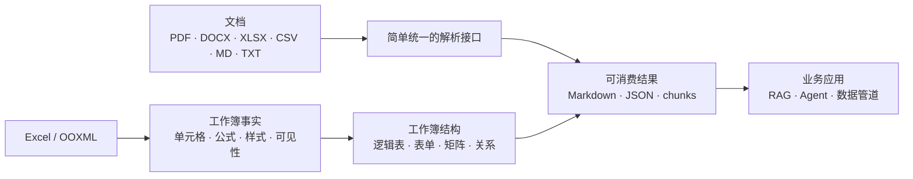

<p align="center">
  
</p>

<h1 align="center">LangParse</h1>

<p align="center"><strong>文档进，结构出。</strong></p>

<p align="center">
  <a href="README.md">English</a>
</p>

<p align="center">
  <a href="LICENSE"></a>
  <a href="https://pypi.org/project/langparse/"></a>
  <a href="https://github.com/syw2014/langparse/actions"></a>
</p>

LangParse 是一个面向开发者的 Python 文档解析工具集，把文档转换为程序、Agent
和数据管道可以直接消费的结构化结果。

项目有两条产品主线：

- **易用的通用文档解析**：用一套可预测的接口处理 PDF、DOCX、Excel、CSV、
  Markdown 和文本，并按需提供分块、批处理、质量检查及可插拔 PDF 后端。
- **更精确、更丰富的 Excel 理解**：保留工作簿事实，识别逻辑表、表单、矩阵、
  文本区域和跨 Sheet 关系，而不是把工作簿直接压平成普通文本。

PDF 和 Word 能力让 LangParse 覆盖完整文档管道；Excel 是项目主动做深、
形成差异化的方向。

---

## 项目状态

首个公开候选版本为 `0.1.0rc1`。多格式解析、OOXML 工作簿结构化、语义分块、
批处理、质量检查和 CI 已可用。项目仍处于 pre-1.0；各模块的真实完成度和已知缺口
以 [docs/PROGRESS.md](docs/PROGRESS.md) 为准。

## 为什么选择 LangParse？

多数文档处理业务并不需要又一个复杂平台，而是需要一套容易安装、容易调用，
并且对自身解析边界足够诚实的工具。

Excel 不能沿用 PDF 和 Word 的文本抽取思路。真实工作簿可能包含公式、合并表头、
重复打印片段、表单、矩阵、隐藏行列、批注、链接以及跨 Sheet 延续的表格。直接转成
Markdown 会丢失后续分析无法恢复的信息。

因此 LangParse 把三层信息明确分开：



丰富结构是事实源；Markdown 和检索分块是从结构派生出的视图，而不是结构的替代品。

## 核心能力

- **统一入口**：`AutoParser.parse_result(...)` 为支持的格式提供一致的结果契约。
- **丰富的 Excel IR**：`.xlsx` 和 `.xlsm` 保留坐标、原始值和显示值、公式、
  缓存值、合并关系、样式指纹、可见性、行列尺寸、打印区域、批注、超链接和对象锚点。
- **工作簿语义结构重建**：确定性地区分逻辑表、表单、矩阵、文本和未分类区域，
  同时保留源范围、置信度和诊断信息。
- **通用文档覆盖**：支持 Markdown、DOCX、旧版 DOC、CSV、文本和 PDF；PDF
  当前可选 `simple`、MinerU 和 DeepDoc 后端。
- **下游可直接消费**：统一 Markdown/JSON、带来源引用的 chunks、批处理、指标和质量检查。
- **可选模型辅助**：工作簿消歧必须显式启用；默认路径保持离线、确定性。

## 安装

安装当前候选版本：

```bash
pip install --pre "langparse==0.1.0rc1"
```

只安装实际需要的可选能力：

```bash
pip install "langparse[excel]"
pip install "langparse[excel,model]"  # 可选的 OpenAI 工作簿消歧
pip install "langparse[deepdoc]"
pip install "langparse[all]"
```

连接已有远程 MinerU API 只需要核心包。只有需要当前 Python 环境提供并启动本地
`mineru-api` 编排服务时，才安装 `langparse[mineru]`。

## 快速开始

### 解析任意已支持文档

```python
from langparse import AutoParser

result = AutoParser.parse_result("report.docx")

print(result.markdown_content)
print(result.metadata)
```

同一入口可处理 PDF、DOCX、Excel、CSV、Markdown 和文本。PDF 只有在需要时才选择后端：

```python
result = AutoParser.parse_result("scan.pdf", engine="deepdoc")
```

### 把 Excel 当作结构读取

```python
from langparse import ExcelParser
from langparse.workbooks import WorkbookIR

result = ExcelParser().parse_result("budget.xlsx")
workbook = result.structure
assert isinstance(workbook, WorkbookIR)
assert workbook.snapshot is not None

first_sheet = workbook.snapshot.sheets[0]
print(first_sheet.cells["B2"].formula)

for sheet in workbook.sheets:
    for block in sheet.blocks:
        print(block.kind, [ref.key for ref in block.source_refs])
```

工作簿 IR 始终关联回原始 Sheet 和单元格范围。可以从它派生 Markdown 或 chunks，
同时保留校验和分析所需的事实。

### 使用 CLI

```bash
langparse parse report.docx --format markdown
langparse parse budget.xlsx --format json --chunk
langparse parse docs/ --batch --chunk --metrics --output-dir out
```

### 分块

分块在遵循 Markdown 结构的同时受尺寸预算约束：标题决定分节，节内的块按 `max_chunk_size` 装箱。

```python
SemanticChunker(max_chunk_size=1000, overlap=0, length_function=len)
```

- **`length_function`** 决定尺寸如何计量。默认按字符数，不引入任何依赖；需要按 token 预算时传入分词器的编码函数：
  ```python
  import tiktoken
  encoder = tiktoken.get_encoding("cl100k_base")
  SemanticChunker(max_chunk_size=512, length_function=lambda t: len(encoder.encode(t)))
  ```
- **`overlap`** 默认关闭。它会让内容在向量库中重复存储，因此设计为按需开启。
- **表格**超出预算时按行切分，每一片都重复表头，保证每个 chunk 单独检索出来也可读。
- **代码块**永不切分——切开会留下未闭合的围栏。超长的代码块整块输出，metadata 标记 `oversized: True`。
- 代码围栏内的 `#` 不会被当作标题。

每个 chunk 携带 `header`、`header_level`、`header_path`、`page_numbers` 和 `chunk_index`。

CLI 侧用 `--chunk` 在 JSON 输出中加入 `chunks` 数组（Markdown 输出用 `---` 分隔），并激活 chunk 相关指标：

```bash
langparse parse paper.pdf --chunk --format json
langparse parse docs/ --batch --chunk --metrics --output-dir out
```

### Excel 结构深入

OOXML 工作簿不再被当作分页的 pandas 表格。每个 Sheet 只保留稳定的兼容序号，
结果设置 `paginated=False`，并从同一次解析中提供无损源事实、确定性逻辑表、
覆盖率诊断、语义 Markdown 和带源范围的逻辑表行 chunks：

```python
from langparse.services.parse_service import ParseService

parsed = ParseService().parse_result(
    "budget.xlsx",
    chunk=True,
    chunk_profile="retrieval",
)
analysis_chunks = ParseService().chunk_result(
    parsed,
    chunk_profile="analysis",
)
print(parsed.structure.snapshot.sheets[0].cells["B2"].formula)
print(parsed.diagnostics.coverage_ratio)
print([block.kind for block in parsed.structure.sheets[0].blocks])
print(parsed.diagnostics.source_ref_validity_ratio)
print(parsed.chunks[0].metadata["chunk_type"])
print(parsed.chunks[0].metadata["source_ranges"])
print(analysis_chunks[0].structured_payload.get("records"))

logical_tables = [
    block.logical_table
    for sheet in parsed.structure.sheets
    for block in sheet.blocks
    if block.logical_table is not None
]
cross_sheet_tables = [
    continuation.logical_table
    for continuation in parsed.structure.table_continuations
]
```

解析器现在可确定性地按空白行/列带拆分独立表格，合并重复打印片段，构造多级
表头路径，识别板块、数据行和合计行，并在不跨板块的前提下按完整逻辑行分块。
候选区域会保守地分类为逻辑表、表单、矩阵、文本或明确的未分类 raw grid，每种
Block 都有带源坐标的 Markdown 和 chunk 路径。`structure.snapshot` 与兼容表仍保留
原始单元格视图。高置信的相邻 Sheet 续表会通过
`structure.table_continuations` 暴露一个聚合逻辑表；证据不足时保持独立，并记录
模糊或拒绝诊断。Markdown 和 chunks 仍按源 Sheet 输出，不复制聚合表；源成员
chunks 可按 `continuation_id` 重新分组。retrieval/analysis 双 chunk profiles 已接入
library、批处理服务和 CLI：`retrieval` 是默认 profile，预算为 1000；`analysis` 的预算
为 4000。两者都保留完整行和精确 source refs；analysis chunks 额外提供规范化、可回查
源坐标的 `records`。同一个已解析结果可通过 `chunk_result()` 重复生成另一套 profile，
无需重新解析，也不会修改其 structure。精确的单元格/公式分析仍应读取
`structure.snapshot`，analysis chunks 不能替代事实层。analysis profile 仅支持 OOXML
workbook 结果；CSV、旧版 `.xls` 和非 workbook 输入继续走兼容路径。

```bash
langparse parse budget.xlsx --chunk --chunk-profile analysis --format json
```

#### 可选的工作簿模型消歧

工作簿模型消歧始终需要调用方显式启用。默认模式为 `off`：直接构造
`ExcelParser()`，或调用 `ParseService` 时不传 `workbook_disambiguation`，都不会构造
模型 Adapter/cache、读取 provider 配置或产生任何隐式模型网络请求。

```bash
pip install "langparse[excel,model]"
export OPENAI_API_KEY="..."
export OPENAI_MODEL="gpt-4o-mini"
# 使用 OpenAI-compatible endpoint 时可选：
export OPENAI_BASE_URL="https://example.invalid/v1"

langparse parse budget.xlsx --model --disambiguation auto --format json
```

CLI 故意不接受 API Key 参数，因为进程参数和 shell history 不是 secret store。只有
`--model` 或显式 `--disambiguation auto|required` 才会启用网络；仅设置环境变量不会
自动启用。紧急停用可设置 `LANGPARSE_DISABLE_MODEL=1`。library API 既可以使用内置的
`OpenAIWorkbookStructureAdapter`，也可以注入其他 `WorkbookStructureModelAdapter`。

```python
from langparse.parsers.excel_parser import ExcelParser
from langparse.services.parse_service import ParseService
from langparse.workbooks.modeling import WorkbookDisambiguation

# `adapter` 由调用方提供，并实现 WorkbookStructureModelAdapter。
direct = ExcelParser(
    disambiguation=WorkbookDisambiguation.auto(adapter)
).parse_result("budget.xlsx")

strict = ParseService().parse_result(
    "budget.xlsx",
    workbook_disambiguation=WorkbookDisambiguation.required(adapter),
)
```

Phase 4A 只处理 **choice-only 的 region-kind 消歧**：只有本地确定性结果为
unclassified、同时存在至少两个不同 kind 的兼容已登记 choice 时才允许调用。响应只能是
用该 case 已登记 `case_id + choice_id` 的 `selected`，或 `abstained`；不能表达 value、
formula、coordinate、range、header、row role、continuation 或任意结构补丁。provider
上报的 confidence 只进入审计，不能成为接受依据。选中的 kind 仍完全从保留的 workbook
snapshot 物化，并继续经过本地 materialization、coverage、reconstruction、row
conservation、continuation 和 source-reference 验证。

模型选择按整个工作簿原子应用：任何一次选择物化失败，或 tentative workbook 未通过
continuation/结构 validator，都会把所有尝试过的选择恢复为保留的确定性 Block，并重新
运行全部 validator；`required` 会把所有被恢复的 case 都报告为 unresolved。

`auto` 遇到 provider、cache、limit、响应契约、物化或最终验证失败，以及 provider
弃权时，保留确定性本地 fallback 并记录净化后的 diagnostics。`required` 对仍未解决的
合法歧义抛出 `RequiredWorkbookDisambiguationError`，该 typed error 会穿透
`ExcelParser` 与 `ParseService`；没有可调用歧义的工作簿在两种模式下都零调用并成功。

启用的 `WorkbookDisambiguation` 值持有私有、线程安全、进程内 runtime/cache；在
`ExcelParser`、`ParseService` 或 batch 调用间复用同一个值时，已验证 response 可成为
重新 decode 的 cache hit。`off` 不构造 runtime/cache。`max_cases` 限制被考虑的 case，
`max_calls` 则是整个工作簿内实际 Adapter 调用（包括 retry）的硬上限；cache hit 不消耗
调用数。timeout 必须是有限、正数、非 bool 的 real，count/byte limit 必须是精确正整数且
不能是 bool。

候选请求有严格的数据最小化边界：它可以携带目标 Sheet 名和 source range、可见单元格
坐标与 display text、value type、style fingerprint、merge geometry、本地标量特征和已登记
choices；不会携带隐藏 Sheet、公式及其缓存值、批注、超链接、图片、其他区域、credential
或 provider secret。只要完整 candidate envelope 内任一单元格含公式——包括未列入
`candidate.cell_refs` 的单元格或 merged child——整个 case 就在本地判定为 unavailable，
不会投影公式或缓存结果。单元格文本一律视为不可信的 Prompt Injection 数据：Adapter port 不
提供工具调用通道，严格响应字段、request checksum、case/choice membership、大小限制和
本地验证共同阻止单元格指令扩大操作范围；response 任意对象层级的重复 JSON member name
都会被拒绝。diagnostics 不保存 prompt、cell text、原始
reply 或 provider 异常正文。进程内、非持久化 cache 的契约不同且更窄：它只保留已经通过
严格 response decode 的 response envelope bytes，每次命中仍重新 decode 和 validation。
cache 不写磁盘，但 envelope 中由 provider 提供的字符串可能留在进程内存中，直到
持有它的 disambiguation 值及其私有 runtime 被释放。每条 model-call audit 都记录本地
schema、prompt、rule、validator、privacy 版本和确定性 fallback 的 rule confidence；这些
值不采信 provider 输入。

工作簿歧义评估可通过下面的显式命令运行：

```bash
langparse benchmark-workbook-ambiguity \
  samples/workbook_ambiguity/public-manifest.json \
  --output-dir reports/workbook-ambiguity

# 真实 provider evidence 仍需显式启用：
langparse benchmark-workbook-ambiguity private-manifest.json --model
```

报告按 digest 不可变发布，发现缺失或被修改的重放产物时会拒绝覆盖。`production_ready`
还要求 holdout 数据、至少 30 个 ambiguous cases 和独立的 operational staging evidence；
仓库内置的 tuning seed 本身永远不能满足发布门。截图/VLM 属于 Phase 4C，第二个领域契约
属于 Phase 4D。

成本熔断不会根据模型名猜测价格。library 调用方设置 `max_cost_usd_per_workbook` 时，必须
同时在 `WorkbookModelPolicy` 中提供 `input_cost_usd_per_million`、
`output_cost_usd_per_million` 和稳定的 `cost_pricing_version`。这些费率应来自实际部署的
provider 合同；OpenAI-compatible endpoint 也遵循同一规则。

Phase 4B 已提供可选的 OpenAI SDK Adapter、基于环境变量的 provider 配置、严格结构化
响应契约、基于已上报 usage/cost 的熔断，以及不可变评估报告管线。这是一条可用的
provider 路径，但本身不等于生产效果证据：放行仍需要有代表性的私有 holdout、staging
延迟/成本/故障模式证据和 provider 隐私审查。token/cost 预算会在已上报 usage 达到限制后
阻止 retry 或后续调用，但无法阻止第一次 provider 调用本身越界，因此它是熔断器，不是
账单硬保证。

summary/index chunks、富信息 `.xls`/`.xlsb` adapter、图片/图表语义 Block、标准 bundle
输出和进一步生产加固仍待后续实现；截图/VLM 属于 Phase 4C，第二个领域契约属于 Phase
4D，分隔文本和旧版输入目前继续走兼容 adapter。

### 扫描件

`simple` 引擎在识别出某页实为图片时会降级到 OCR。触发条件是**整页图片覆盖**与**文本稀疏**同时成立——扫描件往往带水印，而水印文本足以越过任何"低到不会误伤稀疏正文页"的阈值，因此单看文本长度不可靠。

```bash
pip install "langparse[ocr]"
```

```python
PDFParser(engine="simple", enable_ocr=True, ocr_min_chars=500)
```

走了兜底的页会在 metadata 里报告 `ocr_applied` 与 `ocr_text_chars`，并汇总进 `ParseMetrics`。未安装 `rapidocr_onnxruntime` 时解析不会失败，只是该页保留原有的文本层。

### 度量解析保真度

质检度量的是结构：页数、有没有表格。它不回答内容是否**正确**。要度量后者，给 benchmark 样本提供参考输出：

```json
{
  "id": "report-01",
  "path": "samples/report.pdf",
  "expected_markdown": "samples/report.expected.md",
  "expected_tables": [[["Header A", "Header B"], ["1", "2"]]]
}
```

- **文本**按词级归一化编辑距离评分。用词而非字符，是因为重排的换行不算错误，而漏词算。
- **表格**按 TEDS 评分。单元格替换的代价取二者的字符级归一化距离，因此错字比错值得分高，而丢一整行比改一个单元格代价更大。

没有提供参考输出的样本会被报告为**未评分**，而不是满分。

### MinerU 运行时

LangParse 现在可以通过 `mineru-api` 调用 MinerU。你可以传入 `api_url` 连接已有服务，也可以省略 `api_url` 让 LangParse 尝试启动本地 `mineru-api` 并在当前解析任务结束后关闭。若该 API 通过独立 vLLM 服务完成推理，再传入 `backend="vlm-http-client"` 与 `server_url`；它们会作为 `/file_parse` 表单字段发送，这条远程路径不需要安装本地 `[mineru]` extra。

如果当前 Python 环境没有安装 `mineru-api`，可以传入 `--auto-install-runtime` 或 Python 参数 `auto_install_runtime=True`，LangParse 会先在当前环境中安装配置的 MinerU runtime 包，再启动本地服务。

第一阶段产品化重点是 PDF 解析质量和 RAG 可用性：表格 Markdown、页码引用、多列布局风险、OCR 指标、页眉页脚过滤统计、图像/图表 metadata，以及批量解析耗时和页数/秒。

使用形态如下：

```python
from langparse import AutoParser

doc = AutoParser.parse(
    "paper.pdf",
    engine="mineru",
    api_url="http://mineru.example:25820",
    backend="vlm-http-client",
    server_url="http://vlm.example:21670",
    request_timeout=900,
)
```

```python
from langparse import AutoParser

cpu_doc = AutoParser.parse(
    "paper.pdf",
    engine="mineru",
    device="cpu",
    download_dir="./downloads",
)
```

### CLI 示例

CLI 支持全部格式，不限于 PDF。`--engine` 仅对 PDF 生效，其他格式自动路由到对应解析器：

```bash
langparse parse report.docx --format json
langparse parse notes.md --output notes.out.md
langparse parse mixed_folder/ --batch --output-dir out --metrics
```

支持的扩展名：`.pdf`、`.docx`、`.doc`、`.xlsx`、`.xlsm`、`.xls`、`.csv`、`.md`、`.txt`。
批处理的目录展开会全部识别；不支持的文件以退出码 2 和单行错误信息结束。

单文件解析：

```bash
langparse parse paper.pdf --engine mineru \
  --api-url http://mineru.example:25820 \
  --mineru-backend vlm-http-client \
  --mineru-server-url http://vlm.example:21670 \
  --mineru-request-timeout 900 \
  --format json
```

本地缺少 MinerU runtime 时自动安装：

```bash
langparse parse paper.pdf --engine mineru --auto-install-runtime --device cpu --format json
```

批量解析：

```bash
langparse parse docs/ --engine mineru --batch --output-dir out --format json
```

带指标的批量解析：

```bash
langparse parse docs/ --engine mineru --batch --output-dir out --format json --max-workers 4 --skip-existing --metrics
```

产品可用性 benchmark：

```bash
langparse benchmark samples/public.example.json --engine mineru --output-dir reports --max-workers 2
```

benchmark 报告会记录成功率、耗时、页数/秒、表格数量、OCR 指标、多列顺序告警、页眉页脚过滤数量，以及图像/图表 metadata 覆盖情况。

## 🛠️ 本地开发与测试

LangParse 使用 [`uv`](https://github.com/astral-sh/uv) 管理环境和依赖。仓库内的 `.venv` 由 uv 管理，**不含 `pip`**，因此请统一通过 `uv run` 运行命令（直接用 shell 里的 `pip`/`python` 可能指向其他解释器，例如 Anaconda）。

### 准备环境

```bash
# 按 uv.lock 安装全部依赖（含开发/测试）
uv sync --all-extras

# 或按需安装
uv sync                      # 仅核心（无第三方依赖）
uv pip install -e ".[pdf]"   # PDF 解析（pdfplumber）
uv pip install -e ".[docx]"  # Word 解析（python-docx）
uv pip install -e ".[excel]" # Excel 解析（pandas + openpyxl）
uv pip install -e ".[model]" # 可选 OpenAI 工作簿消歧
uv pip install -e ".[ocr]"   # OCR（rapidocr_onnxruntime）
uv pip install -e ".[mineru]" # MinerU API（本地推理后端需显式选择）
uv pip install -e ".[deepdoc]"# DeepDoc 运行时（OCR/版面/表格 ONNX 权重，首次运行下载约 100MB）
uv pip install -e ".[all]"   # 以上全部
```

> 注意：核心安装**没有任何第三方依赖**。PDF/DOCX/Excel 解析需要上面对应的可选依赖；未安装时会抛出指明缺失包名的 `ImportError`，而不是崩溃。`pip install -e ".[dev]"` 即可跑通测试套件。

### 运行测试

```bash
uv run pytest -q
```

### 本地冒烟测试

仓库自带可直接使用的示例输入：

```bash
# Markdown 解析 + 语义分块（无需额外依赖）
uv run python examples/basic_usage.py

# 解析你自己的 PDF（需要 [pdf] 可选依赖）
uv run langparse parse your.pdf --engine simple --format json

# 用自带清单运行 benchmark
uv run langparse benchmark samples/public.example.json --engine simple --output-dir reports
```

仓库自带 `samples/public.example.json`（benchmark 清单模板）。`data/` 用于存放本地测试文档，已被 git 忽略，需要自备。

## 📝 引用 LangParse

如果您在您的研究、产品或出版物中使用了 LangParse，我们非常欢迎您的引用！您可以使用以下 BibTeX 条目：

```bibtex
@software{LangParse_2026,
  author = {syw2014},
  title = {LangParse: A developer-friendly document parsing toolkit with source-grounded Excel understanding},
  month = {September},
  year = {2026},
  publisher = {GitHub},
  url = {https://github.com/syw2014/langparse}
}
```

## 💬 联系方式

如有问题、功能请求或错误报告，建议在 GitHub 仓库中**提交 Issue**。这样便于公开讨论，也能帮助其他可能有相同问题的用户。

## 📋 更新日志

变更记录见 [CHANGELOG_cn.md](CHANGELOG_cn.md)（[English](CHANGELOG.md)），包含版本发布说明和按日期保留的开发历史。

## 📄 许可证

本项目采用 [Apache 2.0 许可证](https://www.apache.org/licenses/LICENSE-2.0)。
